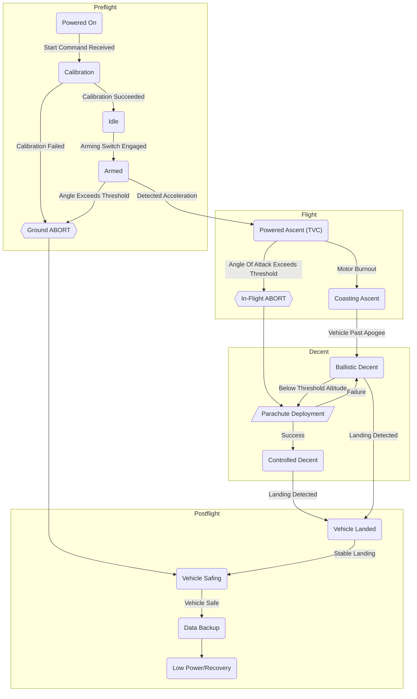

# Flowchart of state machine

```mermaid
graph TD;
    subgraph Preflight
        Ent(Powered On)
        Cal(Calibration)
        Idl(Idle)
        Arm(Armed)

        GAB{{Ground ABORT}}
    end

    subgraph Flight
        Pow("Powered Ascent (TVC)")
        Cst(Coasting Ascent)

        IFA{{In-Flight ABORT}}
    end

    subgraph Decent
        Bal(Ballistic Decent)
        Cod(Controlled Decent)
        Cht[/Parachute Deployment/]
    end

    subgraph Postflight
        Lnd(Vehicle Landed)
        Sfg(Vehicle Safing)
        Bak(Data Backup)
        Hlt(Low Power/Recovery)
    end

    %% Preflight Items
        Ent-- Start Command Received -->Cal;
        Cal-- Calibration Succeeded -->Idl;
        Idl-- Arming Switch Engaged -->Arm;
        Cal-- Calibration Failed -->GAB;

        Arm-- Angle Exceeds Threshold -->GAB;

        GAB-->Sfg;

    %% Flight
        Arm-- Detected Acceleration -->Pow;
        Pow-- Motor Burnout -->Cst;
        Pow-- Angle Of Attack Exceeds Threshold -->IFA

        IFA-->Cht;

    %% Decent
        Cst-- Vehicle Past Apogee -->Bal;
        Bal-- Below Threshold Altitude -->Cht;
        Cht-- Success -->Cod;
        Cht-- Failure -->Bal;

    %% Post Flight
        Cod-- Landing Detected -->Lnd;
        Bal-- Landing Detected -->Lnd;
        Lnd-- Stable Landing -->Sfg;
        Sfg-- Vehicle Safe -->Bak;
        Bak-->Hlt;
```
